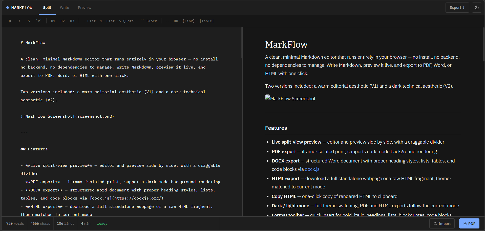

# MarkFlow

A clean, minimal Markdown editor that runs entirely in your browser — no install, no backend, no dependencies to manage. Write Markdown, preview it live, and export to PDF, Word, or HTML with one click.

Two versions included: a warm editorial aesthetic (Type A) and a dark technical aesthetic (Type B).



---

## Features

- **Live split-view preview** — editor and preview side by side, with a draggable divider
- **PDF export** — iframe-isolated print, supports dark mode background rendering
- **DOCX export** — structured Word document with proper heading styles, lists, tables, and code blocks via [docx.js](https://docxjs.org/)
- **HTML export** — download a full standalone webpage or a raw HTML fragment, theme-matched to current mode
- **Copy HTML** — one-click copy of rendered HTML to clipboard
- **Dark / light mode** — full theme switching, PDF and HTML exports follow the current mode
- **Format toolbar** — quick insert for bold, italic, headings, lists, blockquotes, code blocks, tables, links, and horizontal rules
- **Filename editing** — auto-filled from your document's H1, editable before export
- **File import** — open `.md` or `.txt` files via button or drag-and-drop onto the editor
- **Mobile friendly** — bottom tab bar for Edit / Preview switching, format toolbar scrolls horizontally
- **Keyboard shortcuts** — `Cmd/Ctrl+P` for PDF, `Cmd/Ctrl+Shift+D` for DOCX

---

## Getting Started

No build step required. Just open the HTML file in any modern browser.

```bash
git clone https://github.com/wanjay0337/markflow.git
cd markflow
open markflow-v0.00A.html   # warm editorial theme
# or
open markflow-v0.00B.html   # dark technical theme
```

Or drop either file directly onto a browser window.

---

## Files

| File | Description |
|------|-------------|
| `markflow-v0.00A.html` | Warm editorial theme — Fraunces serif headings, Geist UI, amber accent |
| `markflow-v0.00B.html` | Dark technical theme — IBM Plex Mono editor, IBM Plex Serif headings, blue accent |
| `README.md` | This file |

Each file is fully self-contained. No external files, no build tools.

---

## Export Panel

Click **Export ↓** in the top-right corner to open the export panel:

- **Filename** — edit the output filename (auto-filled from H1, shared across all formats)
- **HTML** — download full standalone webpage, download HTML fragment, or copy to clipboard
- **PDF** — opens browser print dialog; set margins to "None" in the dialog for edge-to-edge output
- **DOCX** — downloads a `.docx` file compatible with Microsoft Word, LibreOffice, and Google Docs

---

## PDF Notes

PDF export uses an isolated `<iframe>` with injected CSS rather than `window.print()` on the main page, so the editor UI never appears in the output. Dark mode PDF correctly renders dark backgrounds by setting `print-color-adjust: exact`.

For best results in the browser print dialog:
- Set **Margins** to **None**
- Enable **Background graphics** if your browser asks

---

## Dependencies (CDN, no install needed)

| Library | Version | Purpose |
|---------|---------|---------|
| [marked](https://marked.js.org/) | 9.1.6 | Markdown parsing |
| [DOMPurify](https://github.com/cure53/DOMPurify) | 3.0.6 | HTML sanitisation |
| [docx](https://docxjs.org/) | 7.8.2 | DOCX generation |
| Google Fonts | — | Fraunces, Geist, DM Mono / IBM Plex family |

All loaded from CDN at runtime. Works offline once fonts are cached.

---

## 部署 / Deployment

**中文**

本工具為單一 HTML 檔，可部署至任何靜態伺服器：

**Apache2**
```bash
# 將 index.html 複製到網站根目錄
cp markflow-v0.00A.html /var/www/html/index.html
```

**Nginx**
```bash
cp markflow-v0.00A.html /usr/share/nginx/html/index.html
```

**Netlify / Vercel**
直接拖曳 `index.html` 到部署介面即可。

**English**

This is a single HTML file. Deploy to any static host:

**Apache2**
```bash
cp markflow-v0.00A.html /var/www/html/index.html
```

**Nginx**
```bash
cp markflow-v0.00A.html /usr/share/nginx/html/index.html
```

**Netlify / Vercel**
Drag and drop `index.html` onto the deploy interface.

---

## Browser Support

Chrome / Edge 90+, Firefox 90+, Safari 15+. Requires `navigator.clipboard` for the Copy HTML button (HTTPS or localhost).

---

## License

MIT License

Copyright (c) 2026 by wanjay0337
